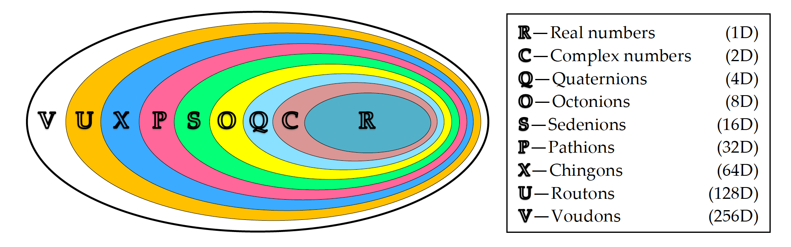

# hyper_rationals (`hyprat`)

[](https://github.com/alreich/hyper_rationals/actions/workflows/ci.yml)
[](https://hyper-rationals.readthedocs.io/en/latest/?badge=latest)

Exact, rational-valued **hypercomplex numbers** -- reals, complex
numbers, quaternions, octonions, and beyond -- built via the
[Cayley-Dickson construction](https://en.wikipedia.org/wiki/Cayley%E2%80%93Dickson_construction),
implemented in the `hyprat` package.


<center><sub><sup>(Figure Source: "Hypercomplex Numbers - A Tool for Enhanced Efficiency and Intelligence in Digital Signal Processing" by Zlatka Valkova-Jarvis, et al.)</sup></sub></center>

### Rational Complex Numbers (rank 1)


```python
>>> from hyprat import Hy
>>> from IPython.display import display, Math

>>> z1 = Hy('5/2', '-16/5')
>>> print(f"{z1 = }\n")
>>> print(f"{str(z1) = }\n")
>>> print(f"{complex(z1) = }\n")
>>> display(Math(z1.latex()))
```

    z1 = Hy('5/2', '-16/5')
    
    str(z1) = '(5/2-16/5j)'
    
    complex(z1) = (2.5-3.2j)
    


$\displaystyle \frac{5}{2}-\frac{16}{5}j$


```python
>>> z2 = Hy('1/3', '3/5')
>>> print(f"{str(z1 * z2) = }")
>>> print(f"{str(z2.norm()) = }")
>>> print(f"{str(z2.inverse()) = }")
```

    str(z1 * z2) = '(413/150+13/30j)'
    str(z2.norm()) = '106/225'
    str(z2.inverse()) = '(75/106-135/106j)'


### Rational Quaternions (rank 2)


```python
>>> q1 = Hy(Hy(1.5, '2/3'), Hy('3/7', 4))
>>> print(f"{q1 = }\n")
>>> print(f"{str(q1) = }\n")
>>> display(Math(q1.latex()))
```

    q1 = Hy(Hy('3/2', '2/3'), Hy('3/7', '4'))
    
    str(q1) = '(3/2+2/3i+3/7j+4k)'
    


$\displaystyle \frac{3}{2}+\frac{2}{3}i+\frac{3}{7}j+4k$


```python
>>> Hy.from_array([1.5, '2/3', '3/7', 4]) == q1
```


    True


```python
>>> Hy.parse('(3/2+2/3i+3/7j+4k)') == q1
```


    True


```python
>>> q2 = Hy(z1, z2)
>>> print(f"{str(q1 * q2) = }")
>>> print(f"{str(q2.norm()) = }")
>>> print(f"{str(q2.inverse()) = }")
```

    str(q1 * q2) = '(1403/420-442/105i-407/35j+7871/630k)'
    str(q2.norm()) = '3053/180'
    str(q2.inverse()) = '(450/3053+576/3053i-60/3053j-108/3053k)'


### Rational Octonions (rank 3)


```python
>>> o1 = Hy.from_array(['2/3', 0, 3, -5, '-2/3', '2/5', '-4/5', 2])
>>> print(f"{o1 = }\n")
>>> print(f"{str(o1) = }\n")
>>> display(Math(o1.latex()))
>>> print(f"\n{Hy.parse(str(o1)) == o1 = }")
```

    o1 = Hy(Hy(Hy('2/3', '0'), Hy('3', '-5')), Hy(Hy('-2/3', '2/5'), Hy('-4/5', '2')))
    
    str(o1) = '(2/3+3j-5k-2/3L+2/5iL-4/5jL+2kL)'
    


$\displaystyle \frac{2}{3}+3j-5k-\frac{2}{3}L+\frac{2}{5}iL-\frac{4}{5}jL+2kL$


    
    Hy.parse(str(o1)) == o1 = True


```python
>>> o2 = Hy(q1, q2)
>>> print(f"{str(o1 * o2) = }")
>>> print(f"{str(o2.norm()) = }")
>>> print(f"{str(o2.inverse()) = }")
```

    str(o1 * o2) = '(11407/525+26566/1575i+31091/3150j-1471/150k+1112/105L-157/315iL-5623/630jL-703/42kL)'
    str(o2.norm()) = '158051/4410'
    str(o2.inverse()) = '(6615/158051-2940/158051i-1890/158051j-17640/158051k-11025/158051L+14112/158051iL-1470/158051jL-2646/158051kL)'


### And So On ...

-----------------------

The single immutable `Hy` class represents every rank:

```text
rank 0  ->  a plain fractions.Fraction             (a "real")
rank 1  ->  Hy(real, imag)                         (a "complex")
rank 2  ->  Hy(h1, h2), where h1 & h2 are rank 1   (a "quaternion")
rank 3  ->  Hy(h3, h4), where h3 & h4 are rank 2   (an "octonion")
rank n  ->  Hy(x, y),   where x & y are rank (n-1) ("sedenion", "pathion", ...)
```

`+ - * /`, conjugation, norms, and inverses all follow the standard
recursive Cayley-Dickson formulas, using exact `fractions.Fraction`
arithmetic throughout -- no floating-point rounding.

## Documentation

Full documentation, including the API reference, is on
[Read the Docs](https://hyper-rationals.readthedocs.io/).

Also, see the Jupyter notebook, ['hyprat_examples.ipynb'](https://github.com/alreich/hyper_rationals/blob/main/notebooks/hyprat_examples.ipynb) in the ``notebooks/`` directory

## Installation

```bash
pip install git+https://github.com/alreich/hyper_rationals.git
```

Or, for local development:

```bash
git clone https://github.com/alreich/hyper_rationals.git
cd hyper_rationals
pip install -e .[dev]
```

## Running the tests

```bash
pytest
```

(or `python -m unittest discover -s tests`)

## Building the docs locally

```bash
pip install -e .[docs]
sphinx-build -b html docs/source docs/_build/html
```

## Project layout

```text
hyper_rationals/
+-- src/hyprat/          the hyprat package  (import as `from hyprat import Hy`)
+-- tests/                unit tests (unittest, run via pytest or unittest)
+-- docs/source/          Sphinx documentation source
+-- notebooks/            Jupyter notebooks (examples, Claude dialog, ...)
+-- papers/               Papers on hypercomplex numbers (quaternions, octonions, ...)
+-- .github/workflows/    CI (tests + docs build)
+-- pyproject.toml        packaging / metadata
+-- .readthedocs.yaml     Read the Docs build config
```

## License

MIT -- see [LICENSE](LICENSE).


```python

```
